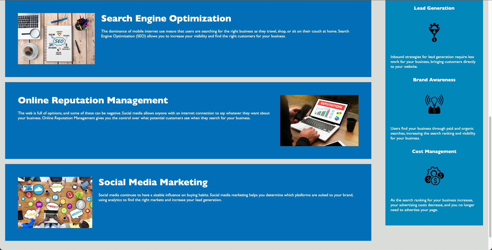

# accessibility-refactor
## Description
The Horiseon Social Solutions webpage provides consumers with context on the social solutions that the Horiseon group can facilitate with. This figurative website was designed by my bootcamp to provide me with a code refactor challenge. Originally, the index.html file primarily used div tags and classes to separete out its contents. Additionally, the style.css file had a few repatative rules and was improperly formatted in some areas. My goal with this refactor was to replace unnecessary div tags with more specific tags (like nav, header, footer, etc.) and include concisions into the style.css file to maintain the integrety of the webpage,  enhance the readabillity of the css, and correctly organize the layout of the css selectors.
## Link
Use this link to view the page: https://agttwilight.github.io/accessibility-refactor/

## Interactivity
The only source of interactivty on this webpage is found towards the top right, in the nav bar. There you may click on "Search Engine Optimization" "Online Reputation Management" or "Social Media Marketing". Clicking on any of the three will result in the browser directing you to the links respective content section!

